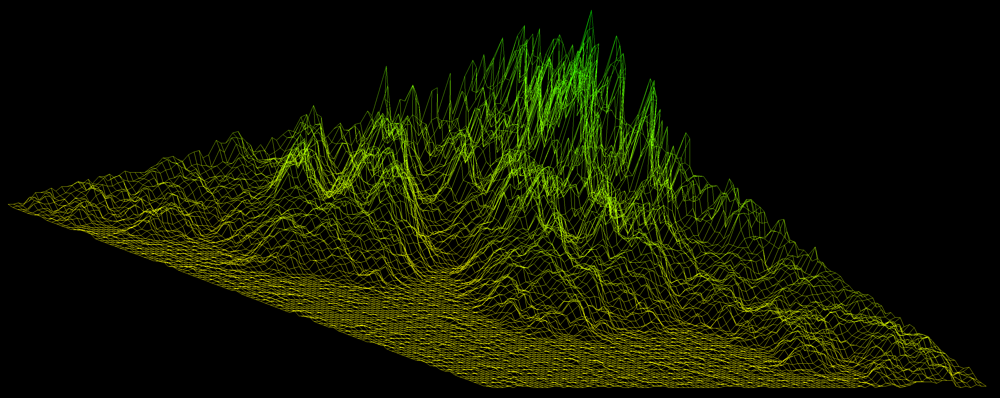
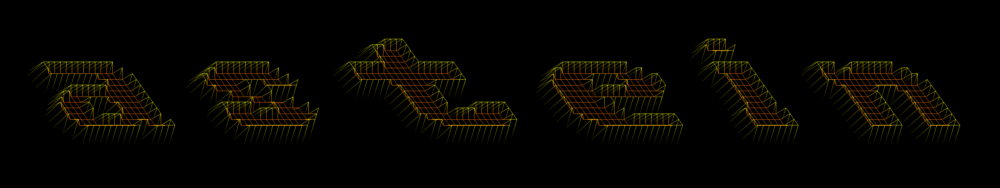
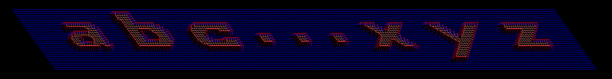
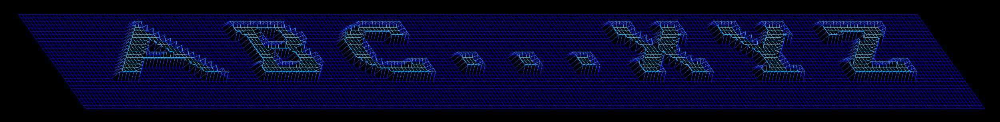
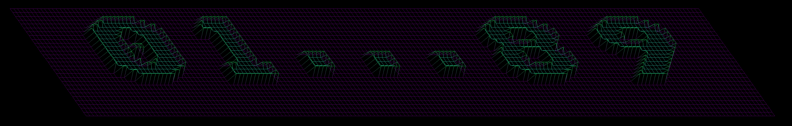
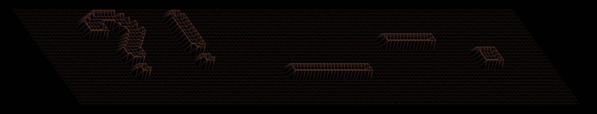

<!-- ahokcool HEADER START-->
---
<a id="top"></a>
<div align="center">
  <a href="https://github.com/ahokcool/ahokcool/blob/main/README.md">
    
  </a><br>
  An overview of all the projects I completed at 42 can be found here: <a href="https://github.com/ahokcool/ahokcool/blob/main/README.md" target="_blank">ahokcool</a><br><br>
  <a href="https://www.42lisboa.com">
    
  </a><br>
  This project was created as part of my studies at  <a href="https://www.42lisboa.com" target="_blank">42 Lisboa</a>.<br>
  
  
  
  
</div>

---
<!-- ahokcool HEADER END-->

<!-- PROJECT HEADER START -->
<br />
<div align="center">
  <a href="./">
    
  </a>
  <h1 align="center">fdf</h1>
<p align="center">
    The idea of the fdf project, French "fil de fer" for "wireframe model", is to visualise wireframe models. This is done by reading a map with 3-D coordinates from a file and storing it in a linked list. These 3D coordinates are then transformed into 2D coordinates according to the user's preferences and displayed in a window.
</p>
</div>
<br>
<!-- PROJECT HEADER END -->

# fdf


## Lessons learned
- working with the API of [a graphics library](https://github.com/42Paris/minilibx-linux)
- understanding points in 2 and 3 dimensional space, vectors and trigonometric functions
- [Bresenham's line algorithm](https://en.wikipedia.org/wiki/Bresenham%27s_line_algorithm)
- Using a [rotation matrix](https://en.wikipedia.org/wiki/Rotation_matrix) to transform coordinates


## (fil de fer) wire-frame models
[📄key commands](resources/help_on_screen.txt)
<br />
### loading a map
```
./fdf ./maps/nice_maps/t2.fdf
```

<br />
### creating a map
```
./fdf astein
```



note: following symbols have a map in ```./maps/letters/```:

```./fdf 'abc...xyz'```


```./fdf 'ABC...XYZ'```


```./fdf '01...89'```


```./fdf '?! _-.'```


some of the maps in ```./maps/nice_maps/``` are from [@duarte3333](https://github.com/duarte3333/FdF_Wireframe_model/tree/main/Maps) thx!
<br />
## useful links
[:link:creating maps](https://patorjk.com/software/taag/#p=display&h=0&f=Doh&t=astein)<br />
[:link:minilibx](https://harm-smits.github.io/42docs/libs/minilibx/getting_started.html)<br />
[:link:minilibx images](https://aurelienbrabant.fr/blog/pixel-drawing-with-the-minilibx)<br />
[:link:drawing lines](https://en.wikipedia.org/wiki/Bresenham%27s_line_algorithm)<br />
[:link:rotating](https://en.wikipedia.org/wiki/Rotation_matrix)<br />

<!-- ahokcool FOOTER-->
---
<p align="center">
  <a href="#top">🔝 back to top 🔝</a>
</p>
